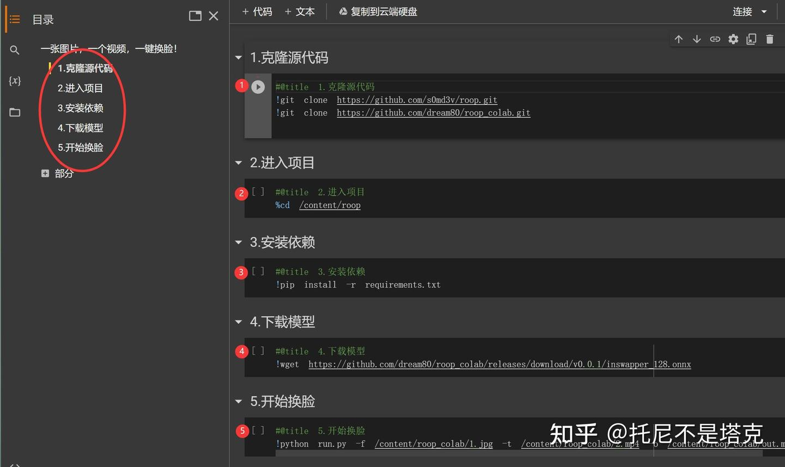
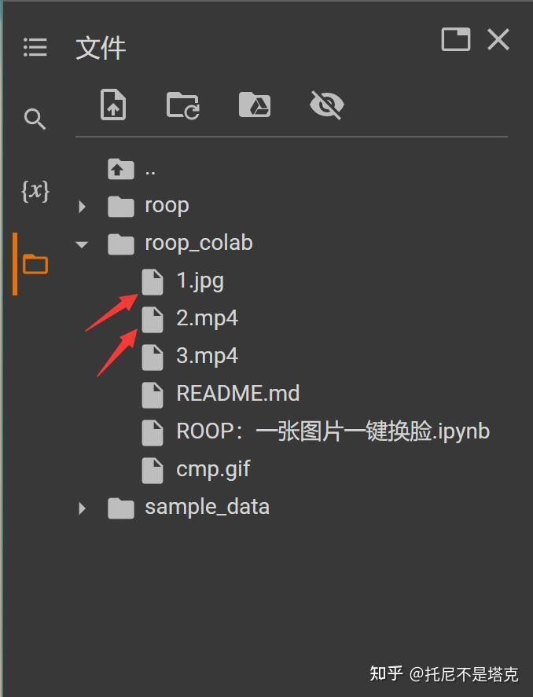
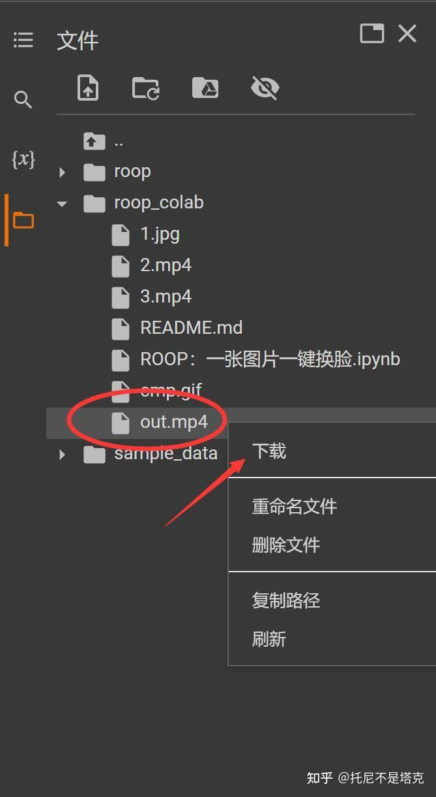
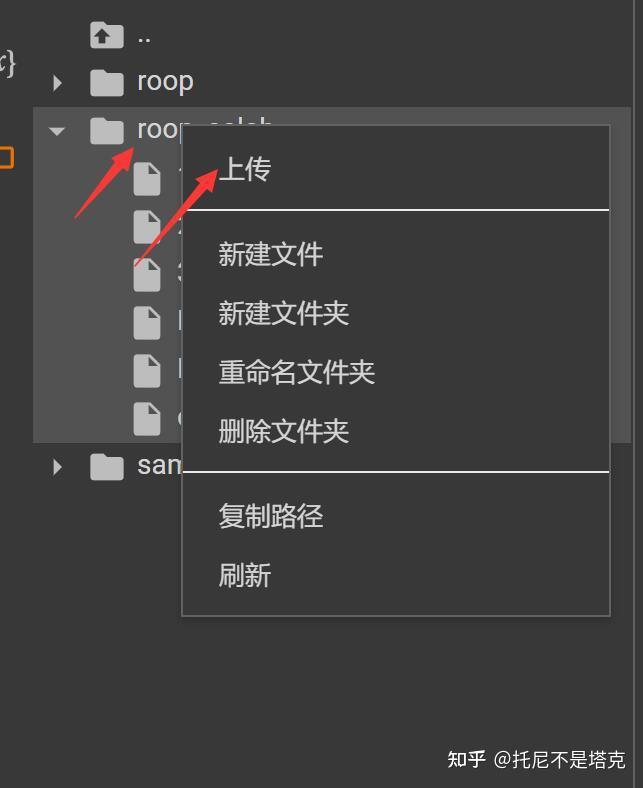

# Colab脚本使用方法
南華大學跨領域-人工智慧期末報告 11218122 李冠霖 10924251 林旂宇

AI領域中有個叫“s0md3v”開源了一個用單圖就能做換臉影片的項目。

首頁就有一張圖為換臉素材的動圖，一圖勝萬言

快速在本地配置一個環境，​​驗證了一下，確實還不錯。主要是，簡單，快速，簡單，快速，簡單，快速！

只是本地配置要下一堆東西，配一堆東西，對一般人來說可能還是有一點壓力，動手能力強一點的估計也得折騰一陣子。

為了節省大家的時間和腦細胞。我已經快速編寫了另一個基於谷歌Colabd的腳本。有需要的直接可以拿去用！

只要魔法加持，無需本地配置，無需高配電腦，點點滑鼠即可完成。

以下簡單介紹一下使用方法~~

首先，打開這個位址：
https://github.com/dream80/roop_colab
然後點選紅色圈中的ipynb檔!

![image]
